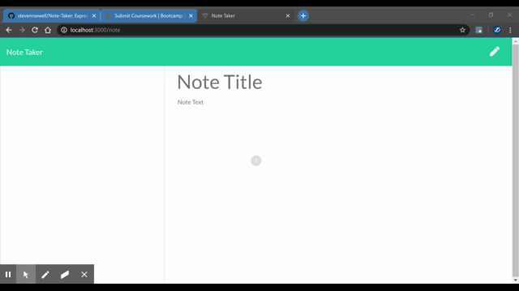

# Note Taker - HW 11
https://github.com/stevenrsewell/Note-Taker

This application is an Express-based note taker app. It allows the user to save and delete notes that remain even when the user refreshes the page. The app is run with the command: 
`node server.js`

## User Story
AS A user, I want to be able to write and save notes ... I WANT to be able to delete notes I've written before ... SO THAT I can organize my thoughts and keep track of tasks I need to complete

## Dependencies Used
<ol>
<li>Node.js</li>
<li>Express</li>
</ol>

## Screenshots
</img>